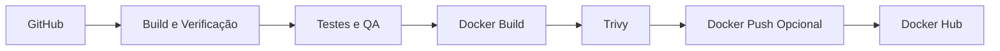
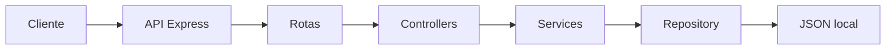
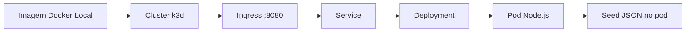
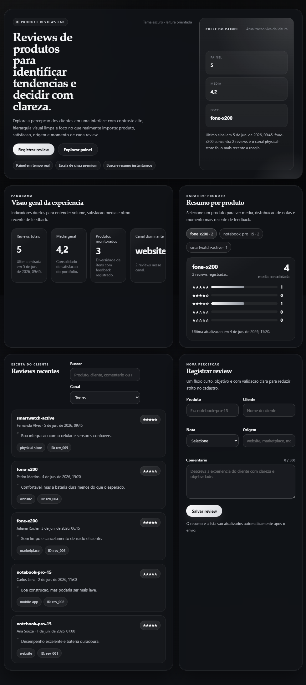
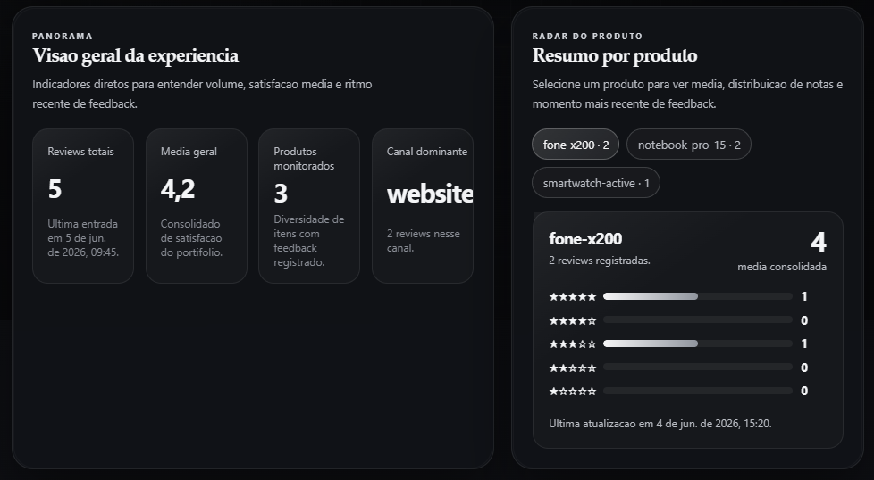
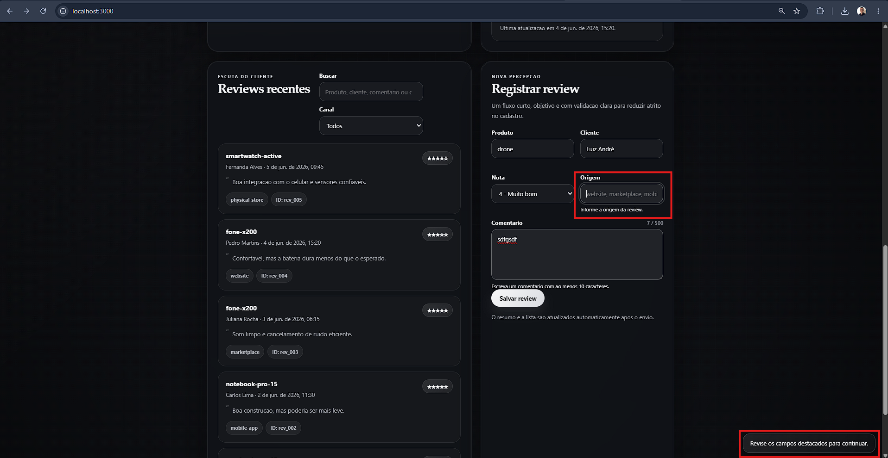
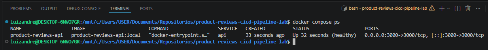
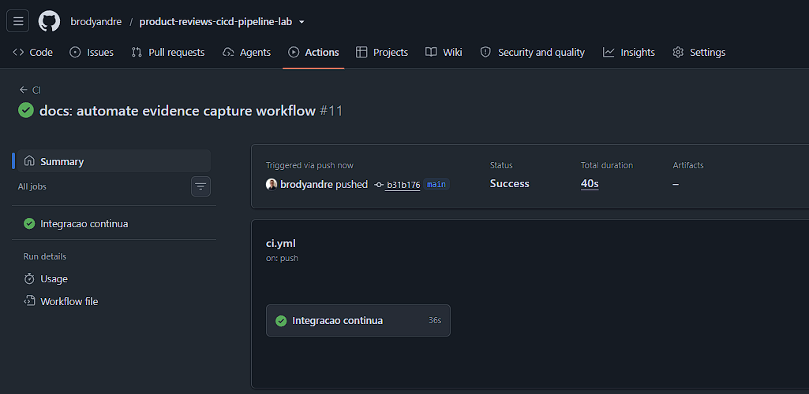
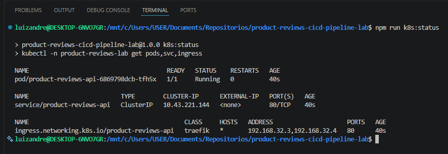
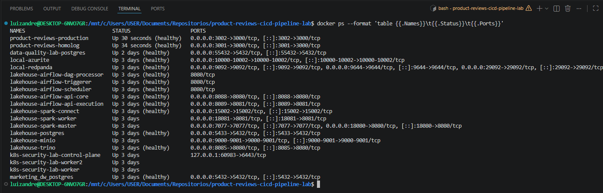

# Product Reviews CI/CD + Kubernetes Lab


Aplicação local de reviews de produtos construída com `Node.js` e `Express` para demonstrar, em um único laboratório, API REST, testes, Docker, GitHub Actions, segurança de imagem, entrega contínua simulada, deploy opcional em `Kubernetes local` com `k3d` e uma interface em tema escuro pensada para leitura rápida e UX mais refinada.

> Este projeto foi pensado para portfólio técnico. Ele não afirma existir em cloud pública. A entrega contínua continua sendo uma simulação local controlada, enquanto o suporte a Kubernetes foi adicionado como trilha opcional de evolução e demonstração de plataforma.

<a id="indice"></a>

## Índice

- [Visão geral](#visao-geral)
- [Destaques técnicos](#destaques-tecnicos)
- [Experiência visual](#experiencia-visual)
- [Arquitetura e fluxos](#arquitetura-e-fluxos)
- [Quick start](#quick-start)
- [Comandos locais](#comandos-locais)
- [Endpoints da API](#endpoints-da-api)
- [Docker](#docker)
- [Kubernetes local com k3d](#kubernetes-local-com-k3d)
- [Testes e qualidade](#testes-e-qualidade)
- [Pipeline de CI](#pipeline-de-ci)
- [Pipeline de CD simulada](#pipeline-de-cd-simulada)
- [Segurança](#seguranca)
- [Estrutura do projeto](#estrutura-do-projeto)
- [Documentação complementar](#documentacao-complementar)
- [Evidências sugeridas para prints](#evidencias-sugeridas-para-prints)
- [Troubleshooting](#troubleshooting)
- [Próximos passos](#proximos-passos)
- [Autor](#autor)

<a id="visao-geral"></a>

## Visão geral

O `product-reviews-cicd-pipeline-lab` foi desenhado para comunicar maturidade técnica de forma rápida. A aplicação entrega uma experiência local agradável, uma API organizada em camadas, persistência simples em JSON, testes automatizados, empacotamento com Docker e dois caminhos de operação de infraestrutura:

- execução direta com `Node.js`
- execução containerizada com `Docker Compose`
- execução opcional em `Kubernetes local` com `k3d`

Na interface web, o projeto agora adota um tema escuro em escala de cinza com contraste alto, cards mais elegantes, hierarquia visual mais clara e feedbacks mais visíveis no fluxo de leitura e cadastro.

Isso torna o projeto útil tanto para avaliação de backend quanto para demonstração de práticas de plataforma, qualidade, segurança e sensibilidade de produto.

[Retornar ao índice](#indice)

<a id="destaques-tecnicos"></a>

## Destaques técnicos

| Pilar        | Implementação neste projeto                                                                   |
| ------------ | --------------------------------------------------------------------------------------------- |
| API          | Express com rotas, controllers, services, repository e validação dedicada                     |
| Persistência | JSON local para facilitar execução e avaliação                                                |
| UX           | Tema escuro em escala de cinza, leitura orientada, busca rápida e cadastro com feedback claro |
| Testes       | Jest com testes unitários e de integração                                                     |
| Qualidade    | ESLint, Prettier, coverage e verificação de inicialização                                     |
| Containers   | Dockerfile multi-stage, usuário não root e healthcheck                                        |
| CI           | GitHub Actions com lint, testes, coverage, Hadolint, Trivy e push opcional                    |
| CD           | Simulação de promoção entre homologação e produção no próprio runner                          |
| Plataforma   | Trilha opcional de Kubernetes local com `k3d`, Ingress e `kubectl apply -k`                   |

[Retornar ao índice](#indice)

<a id="experiencia-visual"></a>

## Experiência visual

A aplicação foi evoluída para uma linguagem mais sóbria e premium, sem cair em visual genérico. O objetivo foi melhorar foco, legibilidade e percepção de qualidade já no primeiro contato com a interface.

### O que mudou na interface

- tema escuro em escala de cinza, com fundo grafite e superfícies profundas
- hero mais editorial, com contraste alto e sensação mais moderna
- cards de métricas, resumo e reviews com presença visual melhor definida
- bloco de contexto vivo no topo da página, destacando volume, média e foco atual
- formulário com contador de caracteres e feedback visual mais claro
- microinterações mais suaves em botões, filtros, pills e cards

### O que isso valoriza para o portfólio

- demonstra atenção à experiência do usuário, não só à API
- reforça maturidade visual sem depender de frameworks pesados
- deixa a aplicação mais apresentável para prints, README e LinkedIn

[Retornar ao índice](#indice)

<a id="arquitetura-e-fluxos"></a>

## Arquitetura e fluxos

Os diagramas completos estão em [docs/architecture.md](docs/architecture.md). Abaixo estão os recortes mais úteis para leitura rápida no GitHub.

### Pipeline principal



### Arquitetura da aplicação



### Trilha opcional em Kubernetes



[Retornar ao índice](#indice)

<a id="quick-start"></a>

## Quick start

### Requisitos

- `Node.js 20+`
- `npm 10+`
- `Docker`
- `Docker Compose`
- `kubectl` e `k3d` apenas para a trilha opcional em Kubernetes

### Subir a aplicação da forma mais simples

```bash
npm install
npm run dev
```

Aplicação disponível em `http://localhost:3000`.

### Caminhos de execução disponíveis

| Modo               | Objetivo                      | URL padrão              |
| ------------------ | ----------------------------- | ----------------------- |
| `Node.js local`    | desenvolvimento rápido        | `http://localhost:3000` |
| `Docker Compose`   | execução reproduzível         | `http://localhost:3000` |
| `k3d + Kubernetes` | demonstração de cluster local | `http://127.0.0.1:8080` |

### O que vale observar na interface

- hero com leitura de contexto no topo
- métricas e resumo por produto em destaque
- busca e filtro de reviews em fluxo curto
- formulário em tema escuro com validação clara

[Retornar ao índice](#indice)

<a id="comandos-locais"></a>

## Comandos locais

### Aplicação e qualidade

```bash
npm install
npm run dev
npm test
npm run coverage
npm run lint
npm run format:check
npm run verify:app
npm run security:check
```

### Docker

```bash
npm run docker:build
docker compose up --build
docker compose ps
docker compose down
```

### Kubernetes local com k3d

```bash
npm run k8s:build
npm run k8s:cluster:create
npm run k8s:deploy
npm run k8s:status
npm run k8s:smoke
npm run k8s:cleanup
npm run k8s:cluster:delete
```

### CD simulada local

```bash
npm run docker:build
npm run cd:cleanup
npm run cd:homolog
npm run smoke:homolog
npm run cd:production
npm run smoke:production
npm run cd:cleanup
```

[Retornar ao índice](#indice)

<a id="endpoints-da-api"></a>

## Endpoints da API

| Método | Rota                               | Descrição                                 |
| ------ | ---------------------------------- | ----------------------------------------- |
| `GET`  | `/`                                | Interface web da aplicação                |
| `GET`  | `/health`                          | Healthcheck básico                        |
| `GET`  | `/ready`                           | Prontidão da aplicação e do arquivo local |
| `GET`  | `/api/reviews`                     | Lista reviews cadastradas                 |
| `GET`  | `/api/reviews/:id`                 | Busca uma review por identificador        |
| `POST` | `/api/reviews`                     | Cria uma nova review                      |
| `GET`  | `/api/products/:productId/summary` | Retorna resumo agregado por produto       |

### Exemplo de payload para `POST /api/reviews`

```json
{
  "productId": "notebook-pro-15",
  "customerName": "Marina Costa",
  "rating": 5,
  "comment": "Excelente custo-benefício para uso profissional.",
  "source": "website"
}
```

### Contratos preservados

- payload inválido retorna `400`
- recurso inexistente retorna `404`
- sucesso usa envelope `success: true`
- erro usa envelope `success: false`

Mais detalhes em [docs/api.md](docs/api.md).

[Retornar ao índice](#indice)

<a id="docker"></a>

## Docker

O projeto usa Docker como trilha principal de empacotamento e execução reproduzível.

### O que já está implementado

- `Dockerfile` multi-stage
- runtime como usuário não root
- `healthcheck` apontando para `/health`
- `.dockerignore`
- `.env.example`
- imagem endurecida para boa compatibilidade com `Trivy`

### Comandos úteis

```bash
npm run docker:build
docker compose up --build
curl http://localhost:3000/health
docker inspect --format='{{json .State.Health}}' product-reviews-api
```

Mais detalhes em [docs/docker.md](docs/docker.md).

[Retornar ao índice](#indice)

<a id="kubernetes-local-com-k3d"></a>

## Kubernetes local com k3d

O repositório agora inclui uma trilha opcional de cluster local para demonstrar repertório de plataforma sem transformar Kubernetes em requisito obrigatório para rodar o projeto.

### O que foi adicionado

- manifests em `k8s/`
- `kustomization.yaml`
- `Deployment`, `Service`, `Ingress`, `ConfigMap` e `Namespace`
- scripts para criar cluster, fazer deploy, validar e limpar recursos

### Fluxo recomendado

```bash
npm run k8s:build
npm run k8s:cluster:create
npm run k8s:deploy
npm run k8s:smoke
curl http://127.0.0.1:8080/health
```

### Como esse setup foi pensado

- cluster local com `k3d`
- exposição da aplicação por `Ingress` em `localhost:8080`
- uso da mesma imagem Docker da aplicação
- seed de dados JSON inicializado dentro do pod para manter a proposta simples do laboratório

Documentação dedicada em [docs/kubernetes.md](docs/kubernetes.md).

[Retornar ao índice](#indice)

<a id="testes-e-qualidade"></a>

## Testes e qualidade

O projeto foi organizado para demonstrar disciplina de engenharia desde a base.

### Cobertura funcional

- testes unitários para services, middlewares e config
- testes de integração para endpoints principais
- coverage em terminal com Jest

### Ferramentas de qualidade

| Ferramenta       | Papel no projeto                                            |
| ---------------- | ----------------------------------------------------------- |
| `Jest`           | valida comportamento da API                                 |
| `ESLint`         | mantém consistência e legibilidade                          |
| `Prettier`       | padroniza formatação                                        |
| `verify:app`     | garante que a aplicação inicializa                          |
| `security:check` | ajuda a evitar versionamento indevido de arquivos sensíveis |

### Comandos principais

```bash
npm run test:unit
npm run test:integration
npm test
npm run coverage
npm run lint
npm run format:check
```

[Retornar ao índice](#indice)

<a id="pipeline-de-ci"></a>

## Pipeline de CI

O workflow de `CI` foi desenhado para ser enxuto, legível e útil para avaliação técnica.

### Etapas principais

1. `Checkout`
2. `Setup Node.js`
3. `npm ci`
4. verificação da aplicação
5. testes unitários
6. testes de integração
7. lint com ESLint
8. coverage
9. Docker lint com Hadolint
10. Docker build
11. scan de vulnerabilidades com Trivy
12. Docker push opcional para Docker Hub

### Características importantes

- permissões mínimas
- `SonarCloud` opcional
- push de imagem apenas em `push` para `main` com secrets configurados
- falha real em vulnerabilidade `HIGH` ou `CRITICAL`

Mais detalhes em [docs/ci-cd-flow.md](docs/ci-cd-flow.md).

[Retornar ao índice](#indice)

<a id="pipeline-de-cd-simulada"></a>

## Pipeline de CD simulada

O projeto não promete deploy real em cloud. Em vez disso, demonstra promoção de artefato de forma controlada e de baixo custo.

### O fluxo faz

- build da imagem Docker
- deploy de homologação local na porta `3001`
- smoke tests em `/health` e `/api/reviews`
- deploy de produção simulada na porta `3002`
- smoke test final
- resumo no GitHub Actions Summary

### Valor para portfólio

- mostra a separação entre CI e CD
- usa o mesmo artefato entre ambientes
- evidencia raciocínio de promoção e validação
- não exige infraestrutura paga

[Retornar ao índice](#indice)

<a id="seguranca"></a>

## Segurança

Segurança aqui não é tratada como detalhe cosmético. Mesmo sendo um laboratório local, o projeto já incorpora controles úteis e visíveis.

### O que está implementado

- `Helmet` na aplicação
- validação robusta no `POST /api/reviews`
- middleware global de erro
- imagem Docker não root
- análise de vulnerabilidades com `Trivy`
- Dockerfile revisado com `Hadolint`
- suporte opcional a `SonarCloud`
- `.env.example` no lugar de segredos reais

### Secrets opcionais

- `DOCKERHUB_USERNAME`
- `DOCKERHUB_TOKEN`
- `SONAR_TOKEN`

Mais detalhes em [docs/security.md](docs/security.md).

[Retornar ao índice](#indice)

<a id="estrutura-do-projeto"></a>

## Estrutura do projeto

```text
product-reviews-cicd-pipeline-lab/
├── .github/workflows/
├── data/
├── docs/
├── k8s/
├── public/
├── scripts/
├── src/
├── tests/
├── Dockerfile
├── docker-compose.yml
├── package.json
└── README.md
```

### Pastas que merecem atenção

- `src/`: aplicação Express organizada em camadas
- `tests/`: testes unitários e de integração
- `scripts/`: automações locais de verificação, CD simulada e Kubernetes
- `k8s/`: manifests para cluster local com `k3d`
- `docs/`: documentação de apoio para avaliação técnica
- `docs/evidences/screenshots/`: local sugerido para prints que serão usados no README

[Retornar ao índice](#indice)

<a id="documentacao-complementar"></a>

## Documentação complementar

- [Arquitetura e fluxos](docs/architecture.md)
- [Fluxo de CI/CD](docs/ci-cd-flow.md)
- [Docker](docs/docker.md)
- [Kubernetes local com k3d](docs/kubernetes.md)
- [API](docs/api.md)
- [Segurança](docs/security.md)
- [Troubleshooting](docs/troubleshooting.md)
- [Guia de evidências](docs/evidence-guide.md)

[Retornar ao índice](#indice)

<a id="evidencias-sugeridas-para-prints"></a>

## Evidências sugeridas para prints

Para fortalecer o portfólio, vale registrar:

- interface web em `localhost:3000`
- resposta de `/health` e `/api/reviews`
- `npm run coverage`
- `docker compose ps`
- workflow de `CI` passando
- workflow de `CD` simulada passando
- `kubectl get pods,svc,ingress -n product-reviews-lab`
- acesso ao app em `http://127.0.0.1:8080`

### Galeria pronta para screenshots

Sugestão de pasta para os arquivos:

- `docs/evidences/screenshots/`

Sugestão de nomes:

| Arquivo sugerido                    | Conteúdo                                      |
| ----------------------------------- | --------------------------------------------- |
| `01-dashboard-dark-theme.png`       | hero, métricas e visual geral da aplicação    |
| `02-summary-and-reviews.png`        | resumo por produto e lista de reviews         |
| `03-form-validation-dark-theme.png` | formulário e estados de validação             |
| `04-docker-compose-health.png`      | container saudável com Docker Compose         |
| `05-ci-success.png`                 | pipeline de CI passando                       |
| `06-kubernetes-local.png`           | `kubectl get pods,svc,ingress` e acesso local |
| `07-cd-simulated-success.png`       | workflow de CD simulada concluído             |

### Bloco pronto para inserir no README depois

Quando os prints existirem, você pode colar algo como:

```md
## Galeria visual









```

Mais sugestões em [docs/evidence-guide.md](docs/evidence-guide.md).

[Retornar ao índice](#indice)

<a id="troubleshooting"></a>

## Troubleshooting

Os erros mais comuns já estão documentados, incluindo:

- problemas com `npm`
- falhas de testes
- build e healthcheck em Docker
- portas ocupadas
- execuções de `CI/CD`
- erros de `k3d`, `kubectl` e Ingress local

Consulte [docs/troubleshooting.md](docs/troubleshooting.md).

[Retornar ao índice](#indice)

<a id="proximos-passos"></a>

## Próximos passos

- adicionar persistência real com banco de dados
- publicar imagem em registry com versionamento semântico
- adicionar evidências visuais do fluxo Kubernetes
- criar trilha opcional de deploy para cluster gerenciado
- ampliar observabilidade com métricas e logs estruturados

[Retornar ao índice](#indice)

<a id="autor"></a>

## Autor

**Luiz André de Souza**

- GitHub: [brodyandre](https://github.com/brodyandre)
- LinkedIn: [luiz-andre-souza-data-engineer](https://www.linkedin.com/in/luiz-andre-souza-data-engineer/)

[Retornar ao índice](#indice)
