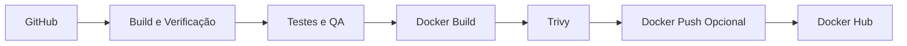
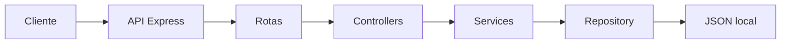

# Product Reviews CI/CD Pipeline Lab


Aplicação local de reviews de produtos construída com Node.js e Express para demonstrar, de forma prática e profissional, competências em API REST, testes, qualidade de código, Docker, GitHub Actions, segurança de imagem e fluxo de entrega contínua simulada.

Este projeto não afirma existir em cloud pública. A etapa de entrega contínua é uma simulação local controlada, criada para demonstrar o raciocínio de CD sem depender de infraestrutura paga.

<a id="indice"></a>

## Índice

- [Visão geral](#visao-geral)
- [O que este projeto demonstra](#o-que-este-projeto-demonstra)
- [Arquitetura e fluxos](#arquitetura-e-fluxos)
- [Comandos locais](#comandos-locais)
- [Endpoints da API](#endpoints-da-api)
- [Docker](#docker)
- [Testes e qualidade](#testes-e-qualidade)
- [Pipeline de CI](#pipeline-de-ci)
- [Pipeline de CD simulada](#pipeline-de-cd-simulada)
- [Segurança](#seguranca)
- [Estrutura do projeto](#estrutura-do-projeto)
- [Evidências sugeridas para prints](#evidencias-sugeridas-para-prints)
- [Troubleshooting](#troubleshooting)
- [Próximos passos](#proximos-passos)
- [Autor](#autor)

<a id="visao-geral"></a>

## Visão geral

O `product-reviews-cicd-pipeline-lab` foi desenhado como um laboratório de portfólio com foco em empregabilidade. Ele combina uma aplicação web leve, uma API REST limpa, persistência local simples e uma esteira técnica que evidencia boas práticas de desenvolvimento moderno.

Pontos centrais do projeto:

- interface web com foco em UX e leitura rápida
- API Express organizada em camadas
- persistência local em JSON para facilitar avaliação e execução
- testes unitários e de integração com cobertura
- containerização com Docker e execução local com Docker Compose
- integração contínua com lint, testes, build, Hadolint, Trivy e push opcional
- entrega contínua simulada localmente para demonstrar promoção entre ambientes

[Retornar ao índice](#indice)

<a id="o-que-este-projeto-demonstra"></a>

## O que este projeto demonstra

Este laboratório foi pensado para comunicar valor técnico de forma objetiva para recrutadores, líderes técnicos e times de engenharia.

- capacidade de estruturar uma API Node.js legível e testável
- preocupação com qualidade desde o início, não como etapa tardia
- domínio de Docker para empacotamento e execução reproduzível
- uso consciente de GitHub Actions para CI e CD simulada
- atenção à segurança com scan de vulnerabilidades por Trivy
- visão de evolução: SonarCloud aparece como extensão opcional natural

[Retornar ao índice](#indice)

<a id="arquitetura-e-fluxos"></a>

## Arquitetura e fluxos

Os diagramas completos estão em [docs/architecture.md](docs/architecture.md). Abaixo estão dois recortes úteis para leitura rápida.

### Visão de pipeline



### Visão da aplicação



Documentação complementar:

- [Arquitetura e diagramas detalhados](docs/architecture.md)
- [Fluxo de CI/CD](docs/ci-cd-flow.md)
- [Docker](docs/docker.md)
- [API](docs/api.md)
- [Segurança](docs/security.md)
- [Troubleshooting](docs/troubleshooting.md)
- [Guia de evidências](docs/evidence-guide.md)

[Retornar ao índice](#indice)

<a id="comandos-locais"></a>

## Comandos locais

### Requisitos

- Node.js 20+
- npm 10+
- Docker e Docker Compose para a parte de containers

### Execução da aplicação

```bash
npm install
npm run dev
```

Aplicação disponível em `http://localhost:3000`.

### Comandos principais

```bash
npm test
npm run coverage
npm run lint
npm run format:check
npm run verify:app
```

### Simulação local de CD

```bash
npm run docker:build
npm run cd:cleanup
npm run cd:homolog
npm run smoke:homolog
npm run cd:production
npm run smoke:production
npm run cd:cleanup
```

[Retornar ao índice](#indice)

<a id="endpoints-da-api"></a>

## Endpoints da API

| Método | Rota                               | Descrição                               |
| ------ | ---------------------------------- | --------------------------------------- |
| `GET`  | `/`                                | Interface web da aplicação              |
| `GET`  | `/health`                          | Healthcheck básico da aplicação         |
| `GET`  | `/ready`                           | Prontidão do serviço e do arquivo local |
| `GET`  | `/api/reviews`                     | Lista reviews cadastradas               |
| `GET`  | `/api/reviews/:id`                 | Busca uma review por identificador      |
| `POST` | `/api/reviews`                     | Cria uma nova review                    |
| `GET`  | `/api/products/:productId/summary` | Retorna resumo agregado por produto     |

### Exemplo de payload para `POST /api/reviews`

```json
{
  "productId": "notebook-pro-15",
  "customerName": "Marina Costa",
  "rating": 5,
  "comment": "Excelente custo-benefício para uso profissional.",
  "source": "website"
}
```

Observações de contrato:

- entradas inválidas retornam `400`
- recursos inexistentes retornam `404`
- respostas seguem um envelope JSON padronizado

[Retornar ao índice](#indice)

<a id="docker"></a>

## Docker

O projeto usa uma imagem Docker com foco em boas práticas:

- `Dockerfile` multi-stage
- execução como usuário não root quando possível
- `healthcheck` apontando para `/health`
- `.dockerignore` para evitar enviar arquivos desnecessários
- `.env.example` para configuração local sem versionar segredos reais

### Build da imagem

```bash
npm run docker:build
```

### Execução com Compose

```bash
docker compose up --build
```

### Validação do healthcheck

```bash
curl http://localhost:3000/health
docker compose ps
docker inspect --format='{{json .State.Health}}' product-reviews-api
```

Mais detalhes em [docs/docker.md](docs/docker.md).

[Retornar ao índice](#indice)

<a id="testes-e-qualidade"></a>

## Testes e qualidade

O projeto foi construído para demonstrar disciplina de engenharia em uma base pequena, mas profissional.

### Cobertura de testes

- testes unitários para services, middlewares e validações
- testes de integração para endpoints principais
- cobertura em terminal com Jest

### Ferramentas de qualidade

- ESLint para consistência de código
- Prettier para padronização de estilo
- validação automatizada no pipeline de CI
- SonarCloud opcional para ampliar inspeção de qualidade e manutenção
- verificação preventiva para arquivos sensíveis versionados por engano

### Comandos

```bash
npm run test:unit
npm run test:integration
npm test
npm run coverage
npm run lint
npm run format:check
npm run security:check
```

[Retornar ao índice](#indice)

<a id="pipeline-de-ci"></a>

## Pipeline de CI

O workflow de integração contínua está em [`.github/workflows/ci.yml`](.github/workflows/ci.yml) e executa em `push` para `main` e `pull_request`.

Etapas principais:

1. checkout do código
2. setup do Node.js
3. `npm ci`
4. verificação da aplicação
5. testes unitários
6. testes de integração
7. análise de código com ESLint
8. coverage
9. SonarCloud opcional
10. Docker lint com Hadolint
11. Docker build
12. scan de vulnerabilidades com Trivy
13. Docker push opcional para Docker Hub, apenas quando aplicável

Observações importantes:

- o push da imagem ocorre apenas em `push` para `main`
- o push é ignorado com segurança se os secrets não existirem
- nenhum secret é exposto em logs ou documentação
- a análise SonarCloud roda apenas se `SONAR_TOKEN` existir

### Como ativar o SonarCloud depois

1. Crie um projeto no SonarCloud.
2. Atualize os placeholders em [`sonar-project.properties`](sonar-project.properties):
   `REPLACE_WITH_SONARCLOUD_PROJECT_KEY` e `REPLACE_WITH_SONARCLOUD_ORGANIZATION`.
3. Adicione o secret `SONAR_TOKEN` no repositório do GitHub.
4. Faça um novo `push` ou abra um novo `pull_request` para validar a análise.

[Retornar ao índice](#indice)

<a id="pipeline-de-cd-simulada"></a>

## Pipeline de CD simulada

O workflow de entrega contínua está em [`.github/workflows/cd.yml`](.github/workflows/cd.yml) e é disparado manualmente via `workflow_dispatch`.

Este fluxo **não representa deploy real em cloud**. Ele existe como simulação local controlada para demonstrar promoção entre ambientes usando a mesma imagem Docker.

Fluxo resumido:

1. build da imagem Docker
2. deploy de homologação no runner, na porta `3001`
3. smoke test em `/health` e `/api/reviews`
4. deploy de produção simulada na porta `3002`
5. smoke test final
6. resumo da execução no GitHub Actions Summary

Isso permite demonstrar CD sem depender de servidor externo, credenciais pagas ou infraestrutura dedicada.

[Retornar ao índice](#indice)

<a id="seguranca"></a>

## Segurança

O projeto inclui controles de segurança compatíveis com o escopo de um laboratório técnico:

- `Trivy` para scan de vulnerabilidades da imagem Docker
- `Hadolint` para revisão do Dockerfile
- healthcheck para monitoramento básico do container
- validação robusta de entrada no `POST /api/reviews`
- secrets de Docker Hub usados apenas quando configurados no GitHub Actions
- `security:check` para detectar arquivos sensíveis versionados por engano

### SonarCloud opcional

O fluxo de arquitetura e CI considera o SonarCloud como extensão opcional. Ele não é obrigatório para o funcionamento do laboratório, mas está previsto como evolução natural para análise mais ampla de qualidade e dívida técnica. Sem `SONAR_TOKEN`, o pipeline continua funcionando normalmente.

### Higiene de segredos

O projeto foi configurado para evitar exposição acidental de dados sensíveis:

- `.env` e `.env.*` ficam fora do versionamento
- apenas `.env.example` é mantido no repositório
- tokens reais não são documentados nem hardcoded
- o comando abaixo ajuda a detectar arquivos sensíveis rastreados por engano:

```bash
npm run security:check
```

[Retornar ao índice](#indice)

<a id="estrutura-do-projeto"></a>

## Estrutura do projeto

```text
.
├── .github/workflows/
├── data/
├── docs/
├── public/
├── scripts/
├── src/
│   ├── config/
│   ├── controllers/
│   ├── middlewares/
│   ├── repositories/
│   ├── routes/
│   ├── services/
│   ├── utils/
│   └── validators/
├── tests/
│   ├── integration/
│   └── unit/
├── Dockerfile
├── docker-compose.yml
├── package.json
└── README.md
```

Leitura prática:

- `src/`: núcleo da aplicação
- `public/`: interface web
- `tests/`: testes unitários e de integração
- `scripts/`: automações locais e simulação de CD
- `docs/`: documentação técnica do laboratório

[Retornar ao índice](#indice)

<a id="evidencias-sugeridas-para-prints"></a>

## Evidências sugeridas para prints

Se este projeto for usado em currículo, portfólio ou LinkedIn, estas capturas ajudam a comunicar valor rapidamente:

- dashboard da aplicação em `http://localhost:3000`
- retorno do endpoint `/api/reviews`
- terminal com `npm run coverage`
- terminal com `npm run lint`
- `docker compose ps` com container saudável
- job de CI passando no GitHub Actions
- job de CD simulada com resumo no Actions Summary
- etapa de Trivy executando no pipeline

[Retornar ao índice](#indice)

<a id="troubleshooting"></a>

## Troubleshooting

### A porta `3000` já está em uso

Pare o processo anterior ou ajuste a porta antes de subir a aplicação.

### O container sobe, mas não fica saudável

Confira:

```bash
docker compose logs -f api
curl http://localhost:3000/health
```

### O smoke test da CD simulada falha

Garanta que os containers de homologação e produção simulada foram criados corretamente:

```bash
docker ps
npm run cd:cleanup
```

### O Docker push não acontece no CI

Isso é esperado quando:

- o evento não é `push` na `main`
- `DOCKERHUB_USERNAME` não está configurado
- `DOCKERHUB_TOKEN` não está configurado

[Retornar ao índice](#indice)

<a id="proximos-passos"></a>

## Próximos passos

Evoluções naturais para ampliar o laboratório:

- integrar SonarCloud com métricas e quality gate
- trocar o JSON local por banco de dados real
- adicionar autenticação e autorização
- incluir observabilidade com logs estruturados e métricas
- publicar imagem em registry com versionamento semântico
- conectar a um ambiente real de homologação em nuvem, se houver contexto de infraestrutura

[Retornar ao índice](#indice)

<a id="autor"></a>

## Autor

**Luiz André de Souza**

- GitHub: [brodyandre](https://github.com/brodyandre)
- LinkedIn: [Luiz André de Souza](https://www.linkedin.com/in/luiz-andre-souza-data-engineer/)

[Retornar ao índice](#indice)
