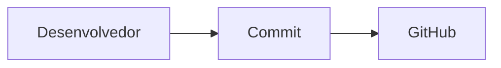
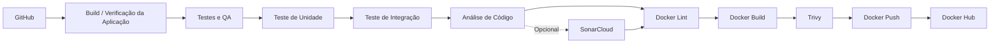
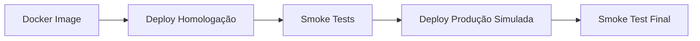
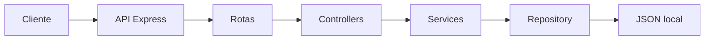
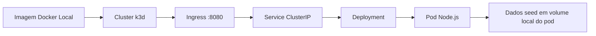

# Arquitetura e Fluxos

Este documento recria, em formato técnico e adaptado ao `product-reviews-cicd-pipeline-lab`, os fluxos principais de desenvolvimento, integração contínua, entrega contínua simulada e arquitetura interna da aplicação.

## 1. Desenvolvimento

### O que este fluxo mostra

- O desenvolvedor implementa mudanças no projeto localmente.
- As alterações são registradas por meio de um commit.
- O código segue para o GitHub, que passa a ser o ponto de entrada da automação.

## 2. Integração Contínua

### O que cada etapa faz

- `GitHub`: recebe o push ou pull request e dispara a pipeline.
- `Build / Verificação da Aplicação`: confirma que a aplicação sobe corretamente e que a estrutura mínima está íntegra.
- `Testes e QA`: agrupa os controles de qualidade antes da etapa de empacotamento.
- `Teste de Unidade`: valida regras isoladas de services, middlewares e validações.
- `Teste de Integração`: verifica os endpoints principais e o contrato da API.
- `Análise de Código`: aplica ESLint e ajuda a manter legibilidade e consistência.
- `SonarCloud`: pode ser conectado futuramente para ampliar métricas de qualidade e dívida técnica.
- `Docker Lint`: revisa o Dockerfile com foco em boas práticas de containerização.
- `Docker Build`: gera a imagem da aplicação pronta para execução.
- `Trivy`: executa o scan de vulnerabilidades na imagem criada.
- `Docker Push`: publica a imagem apenas quando a branch e as credenciais permitirem isso com segurança.
- `Docker Hub`: atua como registro de imagens quando o push opcional é habilitado.

## 3. Entrega Contínua

### O que este fluxo representa

- A imagem Docker aprovada pela CI é usada como artefato de entrega.
- O primeiro deploy ocorre em uma homologação local simulada na porta `3001`.
- Os smoke tests confirmam saúde básica e disponibilidade dos endpoints essenciais.
- Em seguida, a mesma imagem é promovida para uma produção simulada na porta `3002`.
- Um teste final valida que a promoção entre ambientes aconteceu com sucesso.

## 4. Arquitetura da Aplicação

### Leitura simples da arquitetura

- `Cliente`: pode ser a interface web da própria aplicação ou qualquer consumidor HTTP.
- `API Express`: concentra o servidor HTTP e a composição da aplicação.
- `Rotas`: definem os endpoints e conectam cada URL ao fluxo correto.
- `Controllers`: recebem a requisição e transformam o resultado em resposta HTTP padronizada.
- `Services`: concentram as regras de negócio e o comportamento da aplicação.
- `Repository`: encapsula o acesso ao mecanismo de persistência.
- `JSON local`: armazena os dados de reviews sem depender de banco externo.

## 5. Kubernetes Local com k3d

### O que este fluxo acrescenta

- A mesma aplicação também pode ser validada em um cluster Kubernetes local.
- O `k3d` oferece uma forma leve de demonstrar deploy em cluster usando Docker por baixo.
- O `Ingress` expõe a aplicação em `http://127.0.0.1:8080`.
- O `Deployment` mantém o pod da API, com probes de saúde e prontidão.
- O seed de dados parte do JSON versionado no projeto e é copiado para um volume local do pod no startup.

## Como este laboratório se conecta a CI/CD real

Embora este projeto use persistência local em JSON, uma entrega contínua simulada no próprio runner do GitHub Actions e um cluster Kubernetes local opcional, ele representa conceitos reais de engenharia de software:

- separação clara entre desenvolvimento, validação e entrega
- testes automatizados antes de empacotar a aplicação
- validação de qualidade de código e segurança da imagem Docker
- promoção de um mesmo artefato entre ambientes
- deploy opcional em cluster local para reforçar repertório de plataforma
- observabilidade básica por meio de healthcheck e smoke tests

Em um cenário de produção real, a evolução natural deste laboratório seria:

- substituir o JSON local por banco de dados gerenciado
- publicar a imagem em um registry corporativo
- promover o deploy local em `k3d` para um cluster gerenciado em Kubernetes, ECS, App Service ou outra plataforma
- integrar SonarCloud, SAST, DAST e políticas de aprovação
- adicionar rollback, versionamento formal e monitoramento operacional

Assim, o laboratório funciona como uma base de portfólio que demonstra a lógica de CI/CD usada em ambientes profissionais, mas com execução simples, local e de baixo custo.
